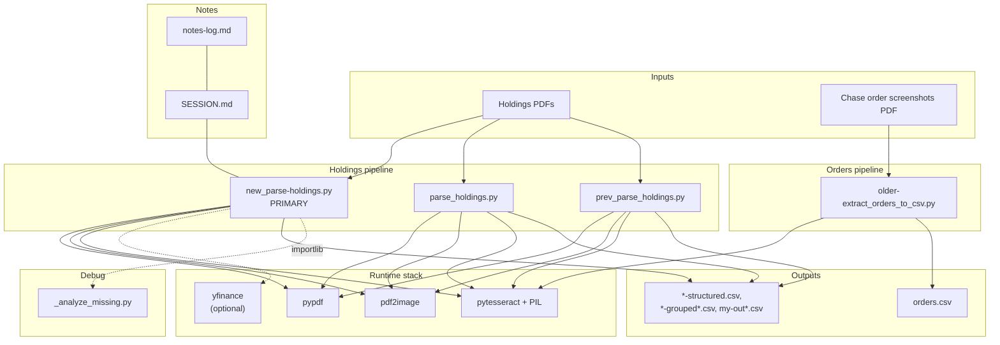
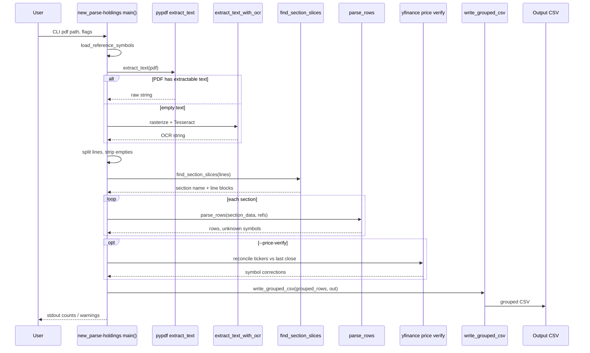
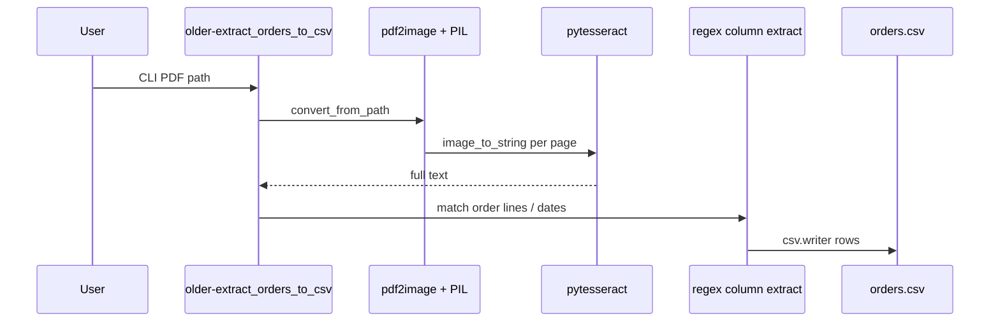

# johnmjohna — architecture

Personal scripts at repo root: **holdings PDF → CSV** (main), **Chase order screenshots → CSV**, plus CSV outputs and handoff notes (`SESSION.md`, `notes-log.md`). There is no `src/` package layout.

## Component diagram

## Sequence: holdings (`new_parse-holdings.py`)

End-to-end flow from `main()`: embedded text first, OCR if the PDF has no text, then sectioning, row parsing, optional Yahoo price reconciliation, then grouped CSV write.

## Sequence: orders (`older-extract_orders_to_csv.py`)

OCR-heavy path: PDF pages to images, Tesseract text, regex extraction into tabular columns (`date`, `symbol`, side, qty, limit, TIF, status). Output shape is documented in `order-stat-cols.txt` and `SESSION.md`.

## Related files

| File | Role |
|------|------|
| `SESSION.md` | One-page resume: commands, focus, Chase vs USB |
| `notes-log.md` | Raw log; newest sections after first `---` |
| `_analyze_missing.py` | Loads `new_parse-holdings.py` via `importlib` to debug parse failures on a fixed PDF |
